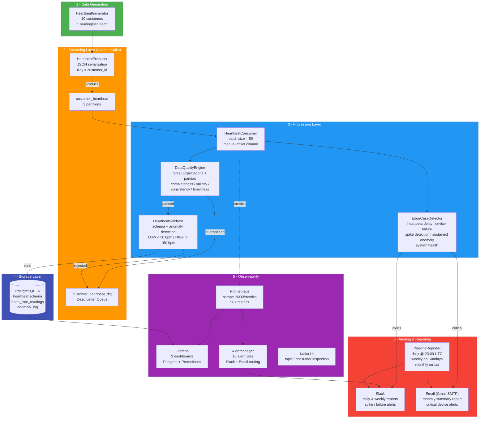
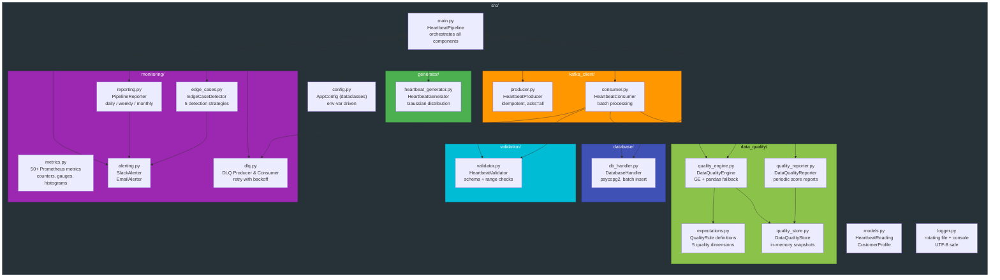
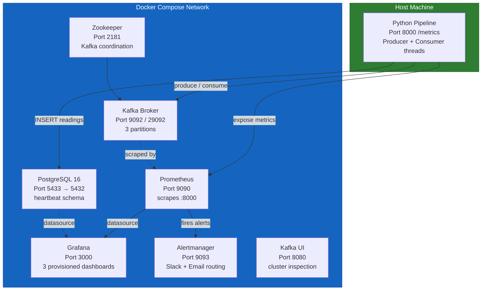
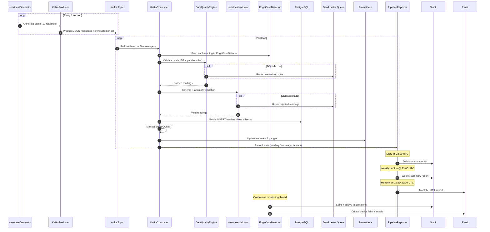
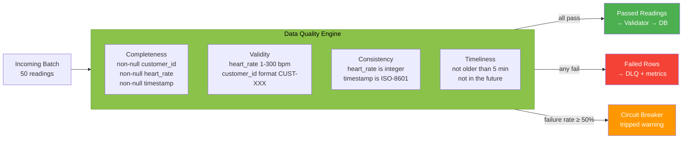
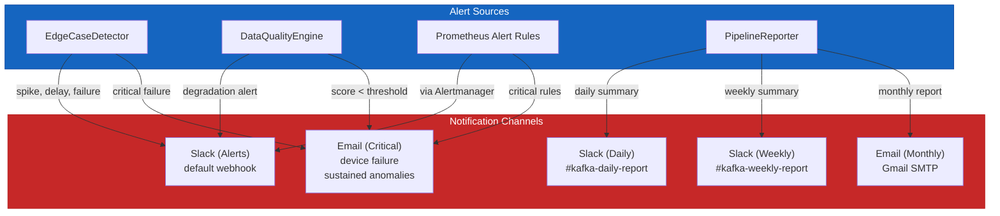
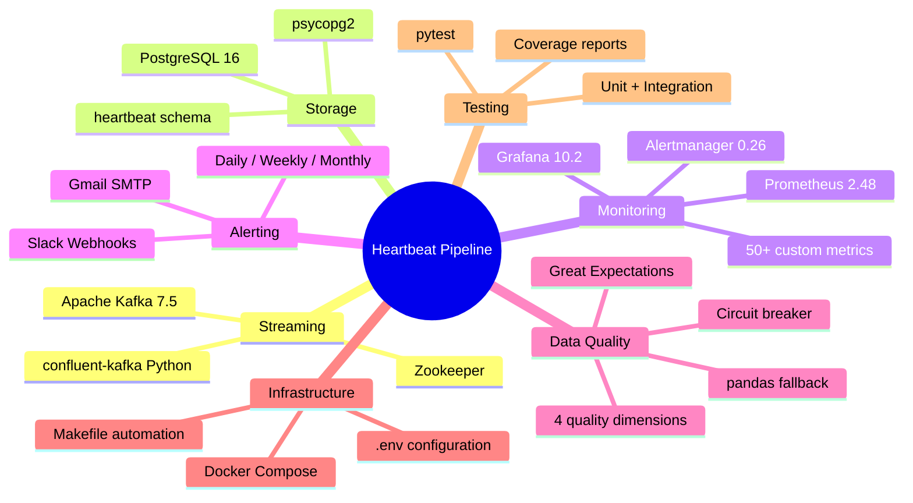

# Architecture Diagram

## System Overview

The **Real-Time Customer Heartbeat Monitoring System** is a production-grade data pipeline built with Python, Apache Kafka, PostgreSQL, Prometheus, and Grafana. It ingests simulated heartbeat sensor data, validates and enriches it in real time, persists it to a relational store, and provides full observability through metrics, alerts, and dashboards.

---

## High-Level Architecture

---

## Component Architecture

---

## Infrastructure (Docker Compose)

---

## Data Flow Sequence

---

## Data Quality Dimensions

---

## Alerting & Reporting Architecture

---

## Monitoring Stack

| Component      | Port  | Purpose                                    |
|----------------|-------|--------------------------------------------|
| Prometheus     | 9090  | Scrapes pipeline metrics every 10s         |
| Grafana        | 3000  | 3 dashboards (heartbeat, prometheus, DQ)   |
| Alertmanager   | 9093  | Routes alerts to Slack & Email             |
| Kafka UI       | 8080  | Topic, consumer group, cluster inspection   |
| Pipeline `/metrics` | 8000 | 50+ Prometheus counters, gauges, histograms |

---

## Grafana Dashboards

| Dashboard                          | Datasource | Key Panels                                                   |
|------------------------------------|------------|--------------------------------------------------------------|
| Customer Heartbeat Monitor         | PostgreSQL | Total readings, active customers, anomalies, heart rate trend |
| Heartbeat Pipeline - Prometheus    | Prometheus | Produced/consumed/persisted, latency p50/p95/p99, DLQ, uptime |
| Heartbeat Pipeline - Data Quality  | Prometheus | Overall DQ score, dimension scores, circuit breaker, failures |

---

## Technology Stack

