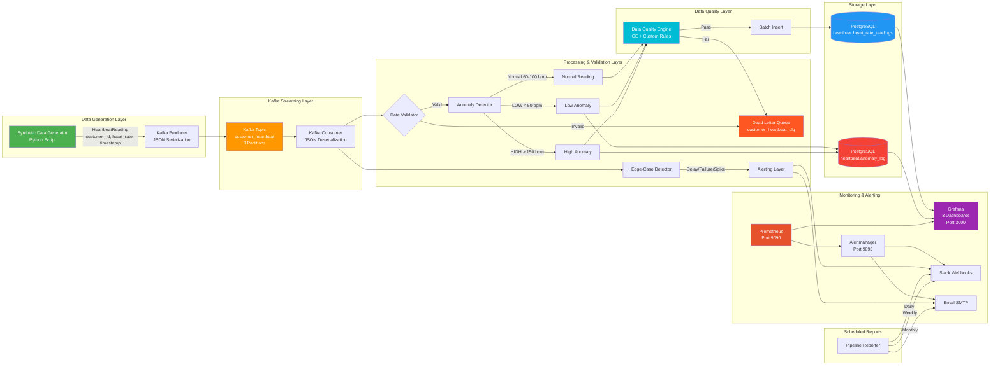
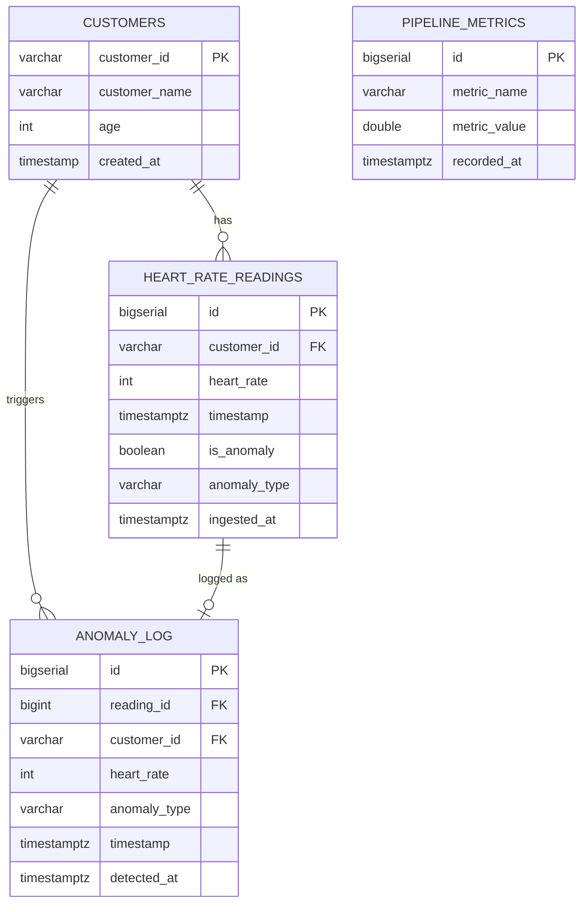
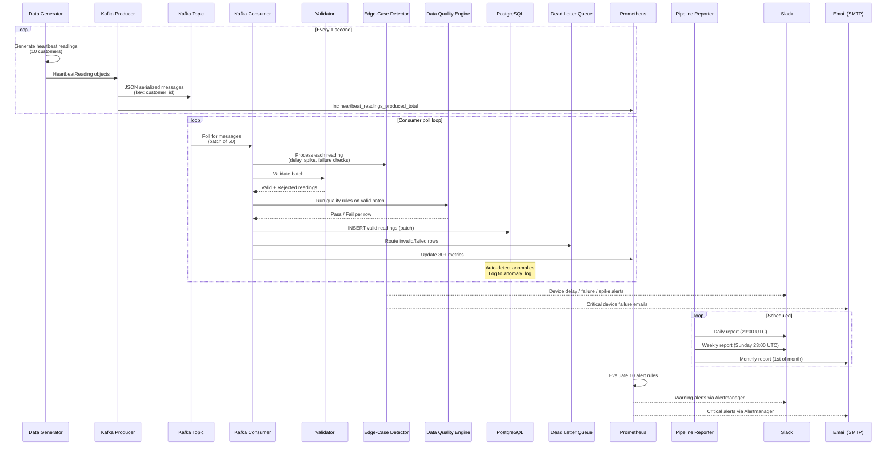
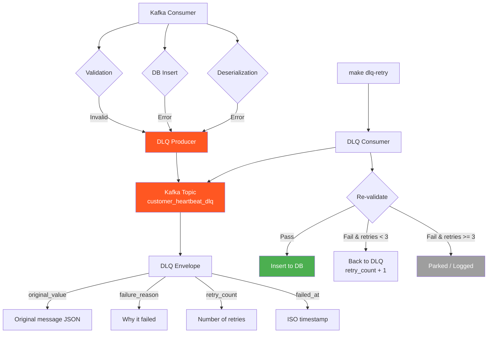
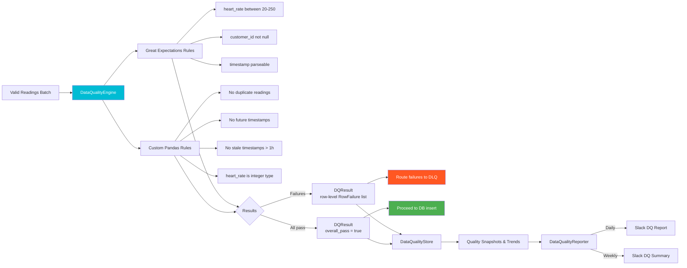

# Data Flow Diagram

## System Architecture

```
┌─────────────────────────────────────────────────────────────────────────────────┐
│                    REAL-TIME CUSTOMER HEARTBEAT MONITORING SYSTEM               │
│                                                                                 │
│  ┌───────────────┐    ┌──────────────┐    ┌──────────────┐    ┌──────────────┐ │
│  │   Synthetic    │    │    Kafka      │    │    Kafka     │    │  PostgreSQL  │ │
│  │     Data       │───▶│   Producer   │───▶│   Consumer   │───▶│   Database   │ │
│  │   Generator    │    │              │    │              │    │              │ │
│  │               │    │  (Serialize   │    │ (Deserialize │    │ (Persist     │ │
│  │ (Python)      │    │   to JSON)   │    │  + Validate) │    │  readings)   │ │
│  └───────────────┘    └──────┬───────┘    └──────┬───────┘    └──────┬───────┘ │
│                              │                    │                    │         │
│                              ▼                    │                    ▼         │
│                     ┌──────────────┐              │           ┌──────────────┐  │
│                     │  Kafka Topic │              │           │   Grafana    │  │
│                     │  (customer_  │──────────────┘           │  Dashboards  │  │
│                     │  heartbeat)  │                          │ (port 3000)  │  │
│                     └──────────────┘                          └──────────────┘  │
│                                                                                 │
│  ┌─────────────────────────────────────────────────────────────────────────┐    │
│  │                        VALIDATION & QUALITY LAYER                       │    │
│  │  • Structural validation (customer_id, heart_rate, timestamp)          │    │
│  │  • Anomaly detection (LOW < 50 bpm, HIGH > 150 bpm)                   │    │
│  │  • Data enrichment (is_anomaly flag, anomaly_type classification)     │    │
│  │  • Data Quality Engine (Great Expectations + custom pandas rules)      │    │
│  │  • Circuit breaker for sustained quality degradation                   │    │
│  └─────────────────────────────────────────────────────────────────────────┘    │
│                                                                                 │
│  ┌─────────────────────────────────────────────────────────────────────────┐    │
│  │                        MONITORING & ALERTING LAYER                      │    │
│  │  • Prometheus (port 9090) — 30+ metrics scraped from :8000/metrics     │    │
│  │  • Alertmanager (port 9093) — 10 alert rules, Slack + Email routing   │    │
│  │  • Edge-Case Detector — delay, failure, spike, quality, system health  │    │
│  │  • Slack webhooks — daily & weekly reports to separate channels        │    │
│  │  • Email (Gmail SMTP) — critical alerts + monthly summary reports      │    │
│  │  • Dead Letter Queue — failed messages to customer_heartbeat_dlq       │    │
│  └─────────────────────────────────────────────────────────────────────────┘    │
│                                                                                 │
│  ┌─────────────────────────────────────────────────────────────────────────┐    │
│  │                        INFRASTRUCTURE (Docker Compose)                  │    │
│  │  • Zookeeper (port 2181) — Kafka coordination                          │    │
│  │  • Kafka (port 9092) — Message broker with 3 partitions               │    │
│  │  • PostgreSQL 16 (port 5433) — Persistent storage with indexes        │    │
│  │  • Prometheus (port 9090) — Metrics collection & alert evaluation     │    │
│  │  • Alertmanager (port 9093) — Alert routing (Slack / Email)           │    │
│  │  • Grafana (port 3000) — 3 dashboards (Heartbeat, Prometheus, DQ)     │    │
│  │  • Kafka UI (port 8080) — Topic, consumer & cluster inspection        │    │
│  └─────────────────────────────────────────────────────────────────────────┘    │
└─────────────────────────────────────────────────────────────────────────────────┘
```

## Mermaid Diagram



## Data Schema Diagram



## Component Interaction Sequence



## Dead Letter Queue Flow



## Data Quality Engine Flow


